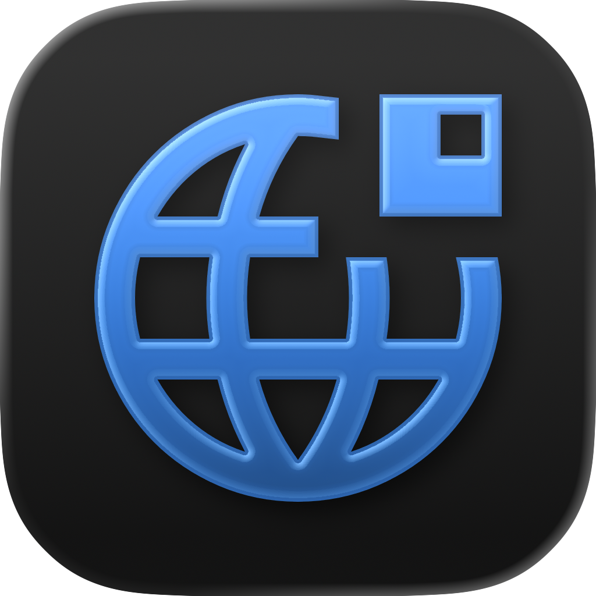
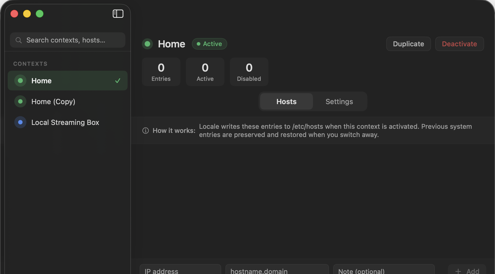
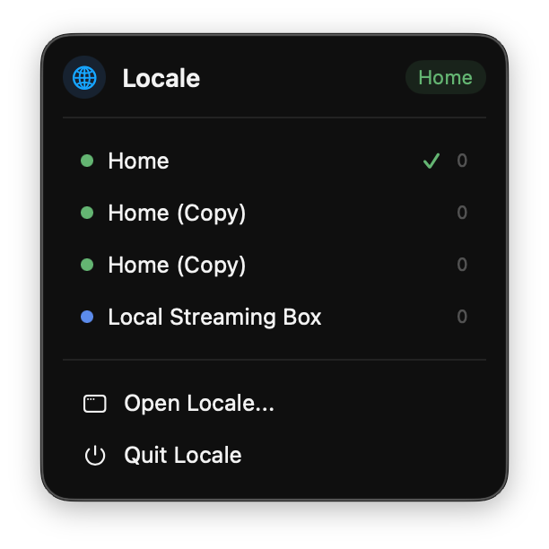
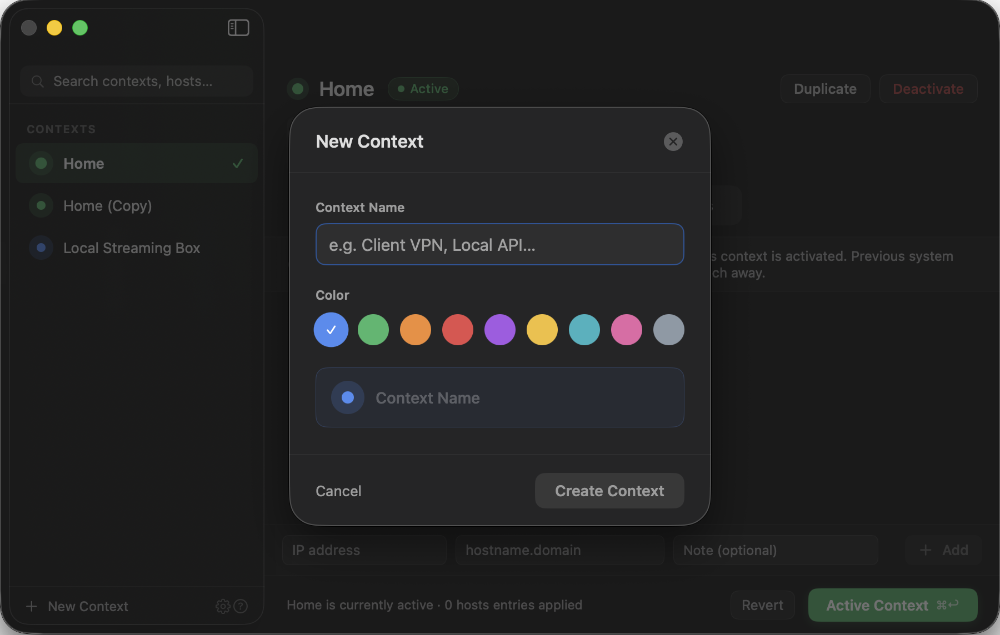

<p align="center">
  
</p>

<h1 align="center">Locale</h1>

<p align="center">Save groups of hostname-to-ip mappings and switch between them in one click. no terminal, no editing system files, no sudo.</p>

<p align="center">
  <a href="https://github.com/offyotto/Locale/releases/latest/download/Locale-notarized.zip"><b>download for mac</b></a>
  ·
  <a href="https://offyotto.github.io/Locale/">website</a>
  ·
  <a href="./LICENSE">license</a>
</p>

<p align="center">
  
  
  
</p>

---

## what it is

locale is a native macos app for switching between named dns contexts. a context is a saved set of hostname-to-ip mappings, so you can point `api.myapp.test` at localhost for one project, at a staging box for another, and flip between them from the menu bar.

it does this through a sandboxed dns proxy network extension. locale never edits `/etc/hosts`, never runs a privileged helper, and never calls `osascript`. when a context is active, matching dns questions get the ip you configured and everything else forwards to your normal system dns.

<p align="center">
  
</p>

## why it exists

the usual way to override a hostname on macos is to edit `/etc/hosts` by hand. that means sudo, a text editor, remembering to comment lines back out, and no clean way to keep separate setups for separate projects. locale keeps each setup as its own context and lets you switch with one click, and it leaves your real hosts file alone.

| | manual /etc/hosts | locale |
| --- | --- | --- |
| switch setups | comment and uncomment by hand | one click |
| separate projects | all mixed in one file | one context each |
| needs sudo | yes | no |
| touches system files | yes | no |
| revert | manual | switch to home context |

## features

- named contexts for local dev, vpns, labs, and temporary debugging
- add, disable, and remove host mappings per context
- apply a context through the bundled dns proxy network extension
- switch active contexts from the menu bar
- revert to a clean home context to clear everything locale manages
- import and export contexts as json
- adaptive app icon that matches light and dark mode

<p align="center">
  
  
</p>

## install

download the notarized build and drag it to applications:

- [download for mac](https://github.com/offyotto/Locale/releases/latest/download/Locale-notarized.zip)

on first launch, macos will ask you to allow the system extension in system settings. this is the dns proxy. locale cannot switch contexts without it.

## build from source

```bash
./script/build_and_run.sh --verify
```

the app bundle is written to `dist/Locale.app`.

for a signed archive, open `Locale.xcodeproj`, select the `LocaleApp` scheme, and use product > archive. do not archive the swift package workspace directly, since package archives show up in organizer as generic xcode archives instead of macos app archives.

## how it works

- the main app writes the active context to shared app group defaults
- `LocaleDNSProxy` reads the same app group data
- matching dns questions receive the configured ip address
- unmatched dns traffic forwards to your system dns servers

no `osascript`, no privileged helper, no direct `/etc/hosts` writes.

## requirements

- macos 14 or newer
- to build and sign: xcode, the swift toolchain, and apple developer capabilities for app groups, system extensions, and the dns proxy network extension

## license

mit, see [LICENSE](./LICENSE).
